# Comunicación Pokémon

Enviar Pokémon desde un PC a **Pokémon Rojo Fuego** en una Nintendo Switch real,
mediante un **intercambio legítimo dentro del juego**, usando la comunicación
local inalámbrica de Nintendo (LDN).

El PC se hace pasar por el segundo jugador. No se modifica la partida guardada
de la Switch: el juego cree que hay alguien sentado en la otra silla del Centro
Pokémon, y ese alguien es un script de Python.

```
PC (Linux)  ──►  .pk3  ──►  frlg-ldn-trade  ──►  Pia  ──►  LDN  ──►  Wi-Fi  ──►  Switch
                                                                                    │
                                                             Centro Pokémon ─ Direct Corner
```

**Funciona de punta a punta.** El primer intercambio real fue el 2026-09-01
(Bulbasaur ⇄ Caterpie); desde entonces se entregan Pokémon generados a medida,
ya desde una interfaz gráfica. La bitácora completa está en
[`docs/ESTADO.md`](docs/ESTADO.md).

---

## Por dónde empezar

| Si quieres… | Ve a |
|---|---|
| **Ver cómo es**, sin instalar nada | [Un intercambio, paso a paso](#un-intercambio-paso-a-paso) — aquí abajo, con capturas de las dos pantallas |
| **Entender cómo funciona** por dentro | [**La arquitectura**](docs/ARQUITECTURA.md) — las seis capas, el `.pk3` byte a byte, el PID, las claves y el método |
| **Hacerlo tú** | [Reproducirlo tú](#reproducirlo-tú) y el [runbook](docs/04_runbook_ubuntu.md) |
| **Leer la bitácora** de lo que salió mal | [`docs/ESTADO.md`](docs/ESTADO.md) |

Todo el código propio es **Python de biblioteca estándar** y **bash**. No hay
framework que aprender antes de entender nada.

---

## Un intercambio, paso a paso

Lo que sigue es un intercambio real, el del **16 de septiembre de 2026**: un
Tauros shiny de nivel 50 sale del PC y un Mankey entra desde la Switch. Las dos
columnas son el mismo instante visto desde los dos lados. El registro completo
de esta misma sesión está en
[`salidas/intercambio-20260916-110020.txt`](salidas/intercambio-20260916-110020.txt).

### 1. Arrancar la ventana

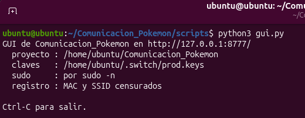

Un comando y una dirección. `127.0.0.1` es **tu propio ordenador**: no hay
servidor, no hay cuenta y no sale nada a internet. El registro sale con las MAC
y el SSID censurados salvo que pidas lo contrario.

### 2. Diseñar el Pokémon

| El mínimo | Con todo |
|---|---|
| 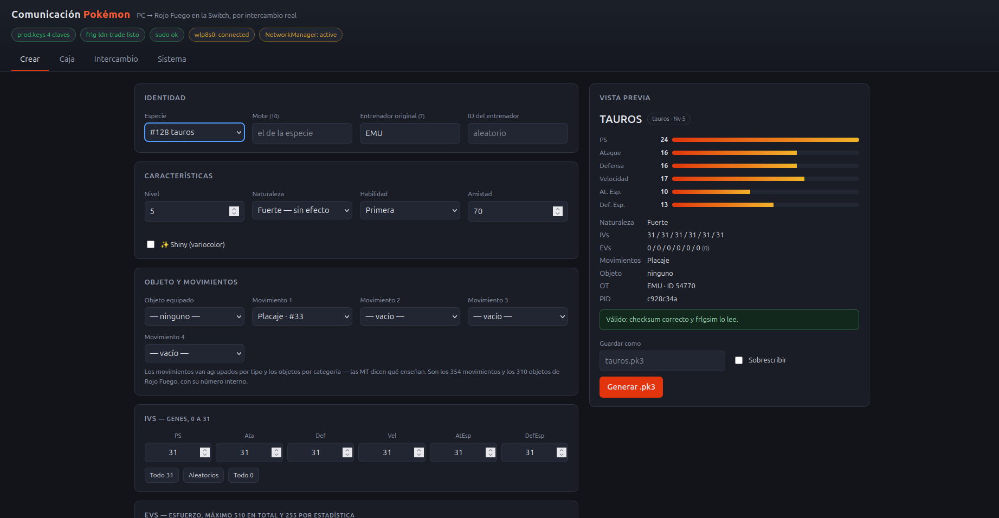 |  |
| Tauros Nv5, un Placaje — `PID c928c34a` | Nv50, shiny, Master Ball, cuatro movimientos — `PID c177edb5` |

Mira los dos PID. El shiny **no es una casilla guardada en el fichero**: es una
propiedad del número, y marcar la casilla pone al generador a buscar uno que la
cumpla. El porqué está en [la arquitectura](docs/ARQUITECTURA.md#anatomía-de-un-pk3).

### 3. Generarlo y guardarlo en la caja

| 80 bytes en disco | Todo lo que tienes |
|---|---|
| 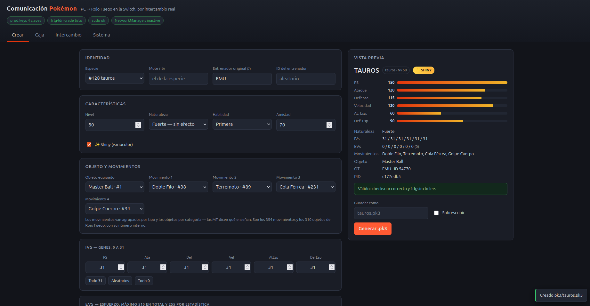 | 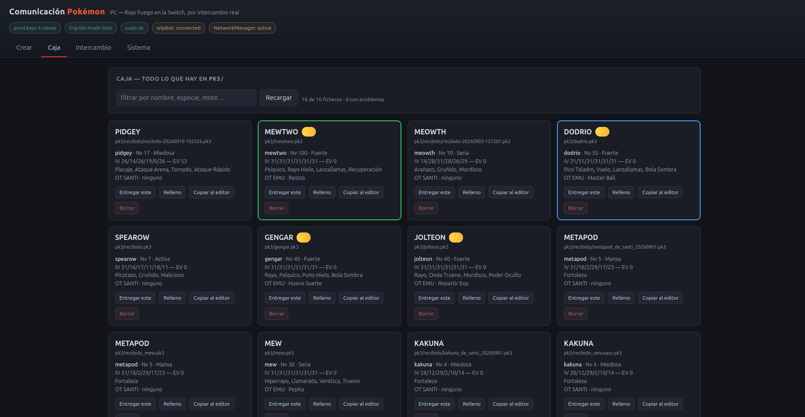 |
| El generador no se cree a sí mismo: antes de dar el fichero por bueno se lo pasa a leer al parser del otro proyecto | Lo generado y lo recibido conviven, validados, con sus IVs y su entrenador original |

### 4. Soltar la radio

LDN necesita la tarjeta Wi-Fi para él solo. La ventana **no te deja lanzar**
hasta que se la has dado:

| Antes | Después |
|---|---|
| 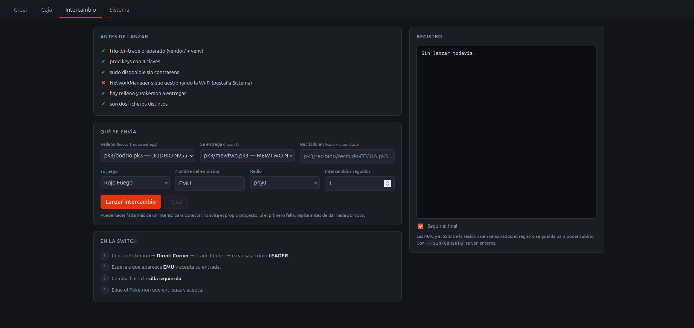 | 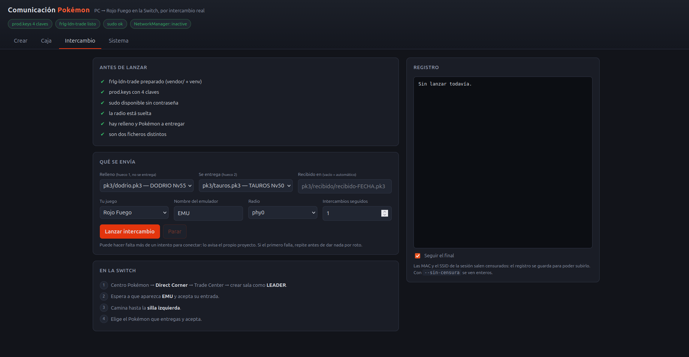 |
| «NetworkManager sigue gestionando la Wi-Fi» | «la radio está suelta» |

Se hace desde la pestaña **Sistema**, y ahí mismo se devuelve al terminar:

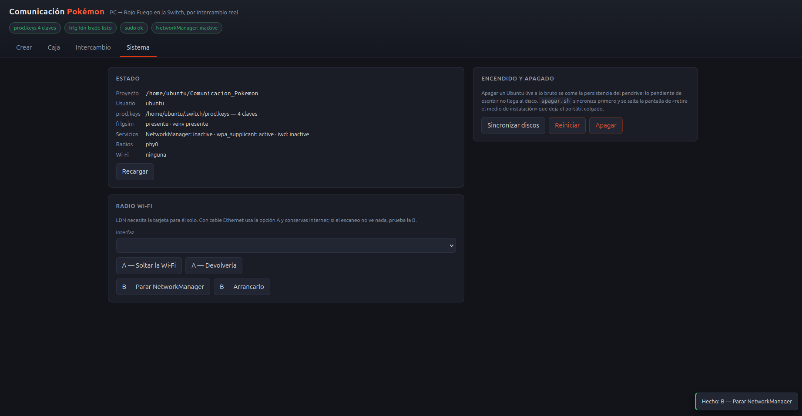

### 5. El PC se presenta

Abres el Trade Center en la Switch, creas la sala como *leader* y lanzas el
intercambio desde la ventana.

| El PC | La Switch |
|---|---|
|  | 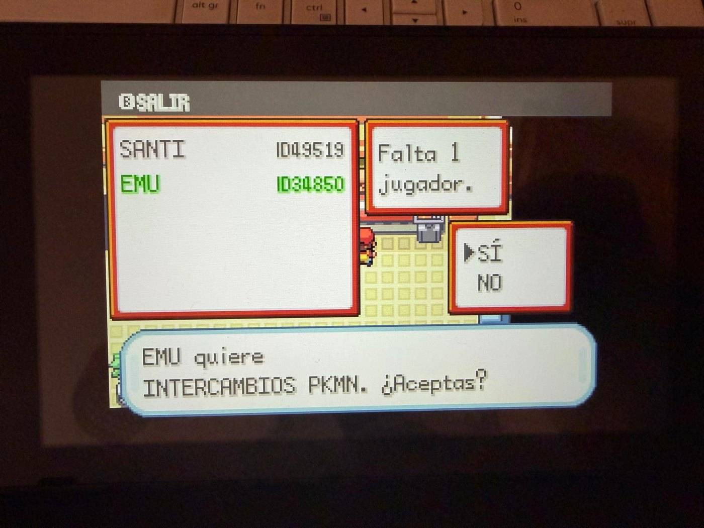 |
| La sesión LDN acepta al segundo jugador | El juego pide permiso para intercambiar con **EMU**, que es un script de Python |

Antes de eso, la consola espera:

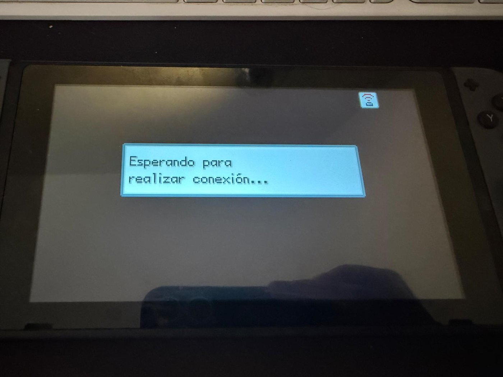

### 6. Sentarse y elegir

| | |
|---|---|
| 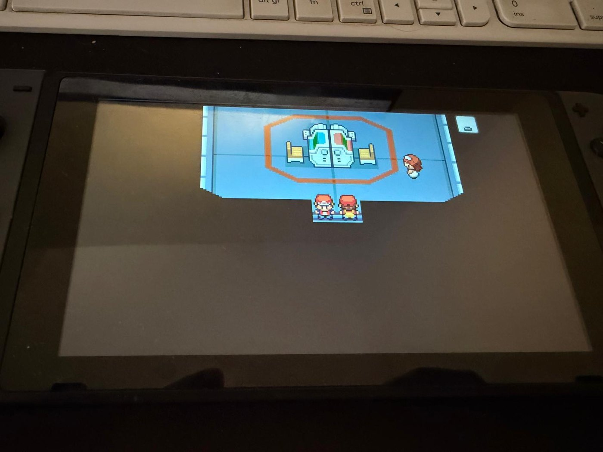 | 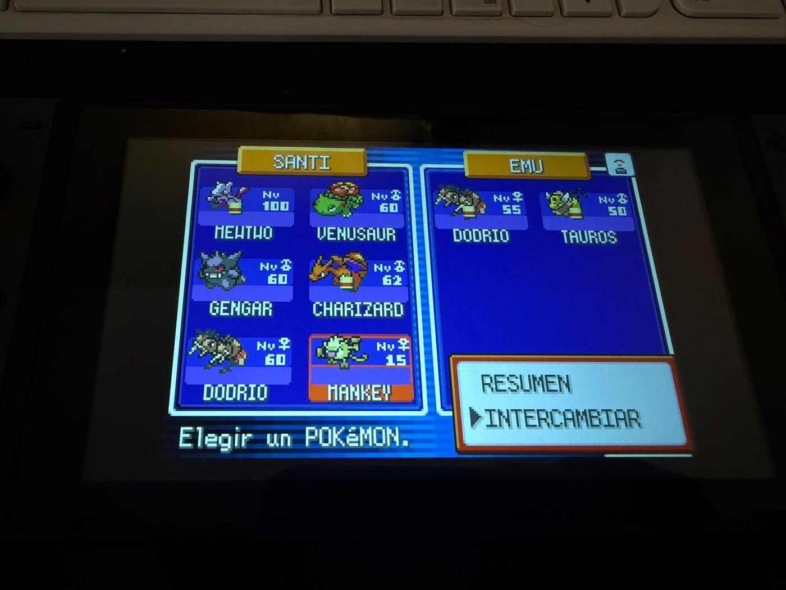 |
| El avatar del PC ha entrado en la habitación y se sienta en la silla de enfrente | Tu equipo a la izquierda, lo que ofrece el PC a la derecha |

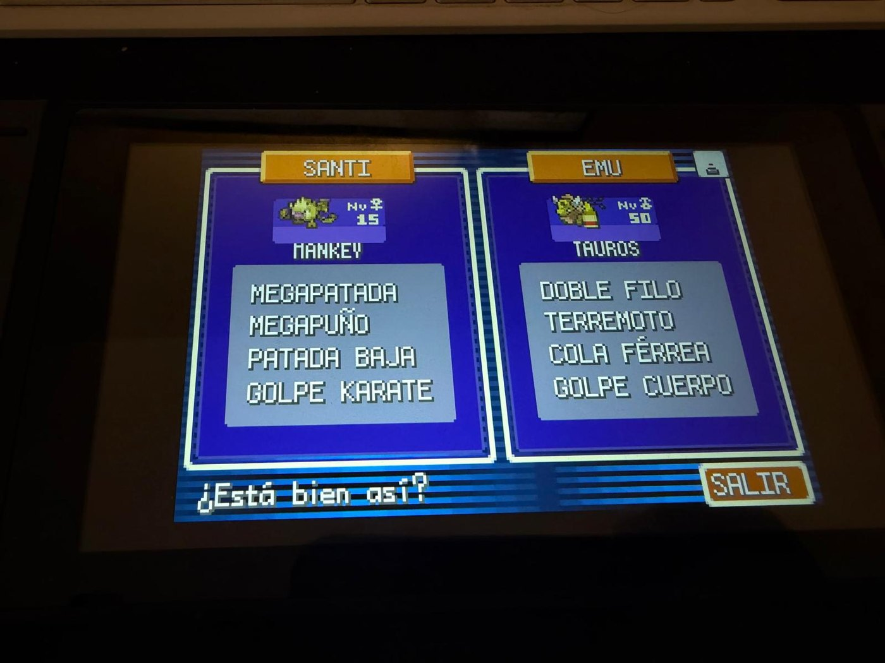

Esos cuatro movimientos del Tauros —Doble Filo, Terremoto, Cola Férrea, Golpe
Cuerpo— son exactamente los que elegiste en los desplegables del paso 2.

### 7. El truco, en pantalla


La animación del intercambio dibuja una **Game Boy Advance**. No es un guiño
nostálgico: la versión de Switch de Rojo Fuego no reimplementó el multijugador,
**emula la consola entera**, así que por dentro sigue circulando el protocolo
del adaptador inalámbrico de 2004. El PC no simula una Switch — simula una GBA
con adaptador, envuelta en capas modernas de Nintendo.

Es la afirmación central del proyecto y la dice el propio juego. El detalle está
en [el recorrido de un byte](docs/ARQUITECTURA.md#el-recorrido-de-un-byte).

### 8. El cruce

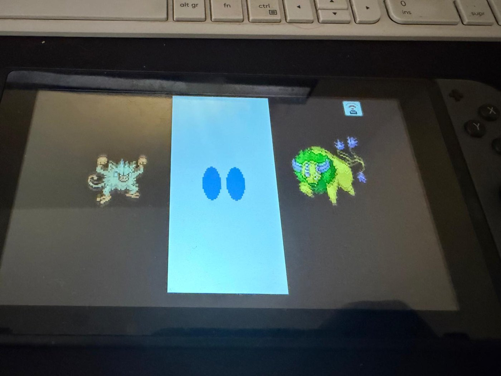

### 9. Lo que llega a cada lado

| El PC recibe un Mankey | La Switch recibe un Tauros shiny |
|---|---|
| 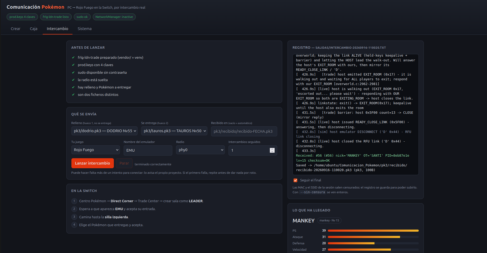 |  |
| `RECEIVED #56 nick='MANKEY' checksum=OK` y el fichero guardado con la fecha en el nombre | Melena verde: el PID que el generador buscó en el paso 2 |

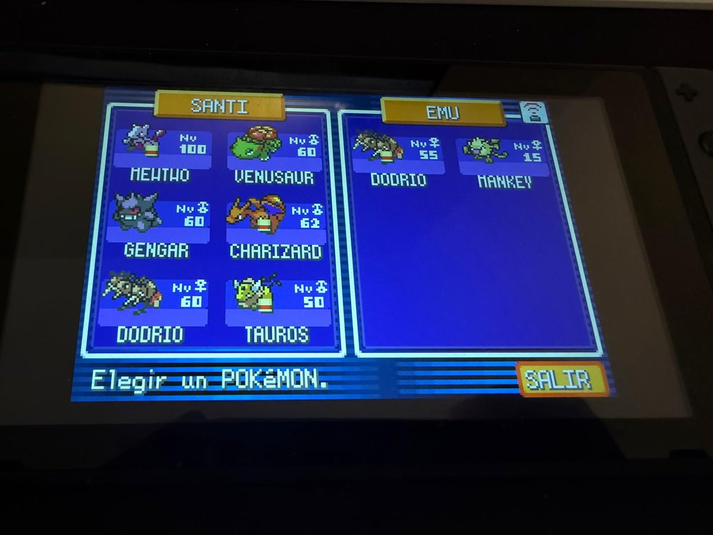

El intercambio fue **en los dos sentidos y de verdad**: la partida guardada de
la Switch no se tocó, el juego ejecutó y validó la operación él mismo, y cada
consola se quedó con lo del otro.

---
## Reproducirlo tú

### Lo que hace falta

| | |
|---|---|
| **Linux** con Python 3.12+ | No sirve una máquina virtual ni WSL: no dan acceso a la radio 802.11. Aquí se usa un **Ubuntu Live USB con partición persistente** |
| Una tarjeta Wi-Fi que **inyecte** | Se comprueba antes de nada. La RTL8852BE interna de un portátil corriente sirve |
| Una **Switch** con Rojo Fuego / Verde Hoja | Compra independiente en la eShop (no requiere Nintendo Switch Online), con el **Direct Corner** desbloqueado (~30 min de partida) |
| Un `prod.keys` con esas 3-4 constantes | Ver arriba. **Nunca se sube al repositorio** |
| Dos `.pk3` | Uno de relleno y el que quieres entregar. Se generan con el propio repositorio |

### La ruta, en orden

Este era el orden previsto y se siguió entero, sin adelantar ningún paso. Cada
enlace es el documento que explica ese paso.

1. **[Crear el Ubuntu Live USB](docs/01_ubuntu_live_usb.md)** — con persistencia,
   o pierdes el entorno en cada reinicio.
2. **[Probar si la Wi-Fi sirve](docs/02_prueba_wifi.md)** — `check_wifi.sh` mira
   lo que el driver *declara*; `check_injection.sh` mira lo que de verdad *hace*.
   Este es el paso que decide si el proyecto es viable con tu hardware, y por eso
   va antes que todo lo demás.
3. **Montar el entorno** — `bash scripts/setup_ubuntu.sh` clona
   `frlg-ldn-trade` en `vendor/`, crea el `venv` y comprueba las claves.
4. **[Conseguir las `prod.keys`](docs/03_prod_keys.md)** — y validarlas con
   `check_keys.py`.
5. **Generar dos `.pk3`** — `python3 scripts/make_pk3.py --preparar-primer-intercambio`.
6. **[El intercambio](docs/04_runbook_ubuntu.md)** — el runbook tiene todos los
   comandos en orden, incluido cómo soltar la radio sin quedarte sin Internet y
   cómo apagar un live USB sin que se cuelgue.

---

## Uso diario: todo desde una ventana

```bash
python3 scripts/gui.py
```

Ese comando arranca el servidor **y** abre el navegador solo. Deja esa terminal
abierta: mientras el comando siga corriendo, la ventana funciona; con `Ctrl+C`
se apaga.

> **`http://127.0.0.1:8777` no es una página de internet.** `127.0.0.1` es tu
> propio ordenador, así que ese enlace sólo responde si has arrancado antes el
> servidor. Si lo pulsas desde GitHub sin haberlo hecho, el navegador dirá *no
> se puede conectar* — no está roto, es que no hay nada escuchando. Arranca
> primero, recarga después.

Dos banderas que hacen falta antes o después:

| | |
|---|---|
| `--sin-navegador` | Arranca sin abrir el navegador, por si ya tienes la pestaña puesta |
| `--puerto 8778` | Si dice que no puede escuchar en el 8777, suele ser que ya tienes otra ventana abierta |

Con el servidor en marcha, <http://127.0.0.1:8777> tiene cuatro pestañas:

| Pestaña | Qué hace |
|---|---|
| **Crear** | Especie, mote, nivel, naturaleza, habilidad, amistad, shiny, objeto, cuatro movimientos, IVs, EVs y el bit *fateful*. Todo en desplegables —los 354 movimientos por tipo, los 310 objetos por categoría, las MT diciendo qué enseñan— y con vista previa de las estadísticas reales que tendrá en el juego |
| **Caja** | Todos tus `.pk3`, validados; elegir cuál se entrega y cuál es relleno, copiar uno al editor para hacer variantes, borrarlo |
| **Intercambio** | Comprobaciones previas, lanzar, registro en vivo y ficha de lo que llega de la Switch |
| **Sistema** | Estado del equipo, soltar y devolver la radio, apagar sin colgarse |

Tres decisiones de diseño que explican por qué es así, y que son las mismas que
tomarías en cualquier herramienta de este tipo:

- **Es una página web local, no una ventana de escritorio.** En el Ubuntu live
  no hay `tkinter`, y gastar persistencia del pendrive en instalarlo no
  compensa: con `http.server` no se instala nada. Además sigue funcionando por
  `127.0.0.1` justo cuando el intercambio deja el equipo sin Internet.
- **Escucha sólo en local**, porque hay botones que ejecutan `sudo`.
- **No reimplementa nada.** Crear es `make_pk3`, leer es `read_pk3`, intercambiar
  es el `frlgtrade.py` del vendor con los argumentos del runbook. Si algo falla
  en la ventana, falla igual en la consola — y al revés, que es lo que hace que
  merezca la pena.

Detalle en [`docs/05_gui.md`](docs/05_gui.md). Lo mismo por línea de órdenes:

```bash
python3 scripts/make_pk3.py --especie dragonite --nivel 55 --naturaleza firme \
    --shiny --objeto "Restos" --movimientos "Terremoto,Hiperrayo,Vuelo,Rayo" \
    -o pk3/drake.pk3
python3 scripts/read_pk3.py pk3/drake.pk3
```

---

## La parte técnica

Todo lo anterior es *qué se ve*. El **[por qué](docs/ARQUITECTURA.md)** está
en un documento aparte, porque es otra lectura y otro ritmo:

| | |
|---|---|
| [**El recorrido de un byte**](docs/ARQUITECTURA.md#el-recorrido-de-un-byte) | Las seis capas entre tu Pikachu y una onda de radio, y cuál de ellas implementa este repositorio (una) |
| [**Anatomía de un `.pk3`**](docs/ARQUITECTURA.md#anatomía-de-un-pk3) | 80 bytes, cuatro subestructuras barajadas, un cifrado que es un XOR de juguete, y un PID que gobierna naturaleza, shiny, orden interno y clave a la vez |
| [**Las claves**](docs/ARQUITECTURA.md#las-claves-menos-misterio-del-que-parece) | Por qué el proyecto se dio por muerto sin motivo, y qué pide LDN de verdad |
| [**Cómo se depura**](docs/ARQUITECTURA.md#cómo-se-depura-síntoma--capa) | La tabla síntoma → capa: cada fallo tiene una firma que dice dónde mirar |
| [**El método**](docs/ARQUITECTURA.md#el-método-por-qué-el-orden-importó) | Cómo se ordenó el trabajo con dos incógnitas capaces de matar el proyecto entero. Es la parte más reutilizable de todo esto, y no va de Pokémon |

---

## Qué no se sube

- **`prod.keys`**, nunca. Está en `.gitignore` (`prod.keys`, `*.keys`,
  `.switch/`).
- **Las MAC de los registros.** Cada `salidas/intercambio-*.txt` llevaba una
  línea con la MAC del PC, la de la Switch y el SSID de la sesión. **La GUI ya
  la censura al guardar**, así que lo que salga de `scripts/gui.py` se puede
  subir tal cual. Si lanzas el intercambio a mano desde el runbook, o con
  `--sin-censura`, tápala tú.
- **Las redes de los vecinos.** `check_injection.sh` lista los AP que ve, y
  ese listado de BSSID basta para geolocalizar el portal de tu casa en
  WiGLE. En `salidas/inyeccion.txt` los BSSID son sinteticos
  (`02:00:00:00:00:NN`) y los SSID, pseudonimos.
- **Los `.pk3` propios**, salvo los dos de `pk3/ejemplos/`.
- **Credenciales en `.git/config`.** Si clonas por HTTPS con un token acaba
  guardado en claro dentro del `.git`. Usa SSH o un *credential helper*.

Nada de esto depende de acordarse. Hay un `pre-commit` que aborta el commit
si en las lineas nuevas aparece una MAC real, el nombre de una red conocida
o un fichero `.keys`. Se activa una vez por clon:

```bash
git config core.hooksPath scripts/hooks
```

---

## Alcance y límites

- **No modifica la partida guardada de la Switch.** El Pokémon entra por la
  puerta principal: un intercambio que el propio juego ejecuta y valida.
- **No se distribuyen claves, ROMs ni volcados.** El repositorio explica qué
  valores necesita el protocolo y por qué; conseguirlos es cosa tuya, y las
  implicaciones legales dependen de tu jurisdicción.
- **No comprueba la *legalidad* de lo que genera.** Puedes crear un Pokémon con
  movimientos que esa especie no aprende o EVs imposibles. El juego lo acepta,
  pero no sería legal para competición ni pasaría los filtros de las entregas
  posteriores. Es lo siguiente en la lista, junto con una biblioteca de
  plantillas.
- **Enganchar puede costar varios intentos.** Lo avisa el propio proyecto
  original; no es señal de que algo esté mal.

---

## Mapa del repositorio

```
docs/
  ARQUITECTURA.md        La mitad técnica: las capas, el .pk3, el PID, el método
  img/                   Las capturas del paso a paso del README
  00_BLUEPRINT.md        Diseño técnico completo, escrito ANTES de empezar
  01_ubuntu_live_usb.md  Crear el USB arrancable desde Windows
  02_prueba_wifi.md      Cómo interpretar el test de la tarjeta Wi-Fi
  03_prod_keys.md        Qué claves pide el proyecto y por qué (con trazas al código)
  04_runbook_ubuntu.md   Todos los comandos de Ubuntu, en orden
  05_gui.md              La interfaz gráfica: qué hace cada pestaña
  ESTADO.md              Bitácora: qué se probó, qué salió, qué se corrigió
scripts/
  check_wifi.sh          Diagnóstico de la tarjeta (lo que el driver declara)
  check_injection.sh     Prueba de inyección real de frames (lo que de verdad hace)
  check_keys.py          Valida un prod.keys con las reglas de ldn.load_keys()
  escuchar_ldn.sh        ¿Emite la Switch? Escucha cruda por canal, sin claves
  make_pk3.py            Genera .pk3 Gen III válidos usando el propio frlgsim
  read_pk3.py            Inspecciona y valida .pk3/.ek3 existentes
  tablas/                Los 310 objetos y 354 movimientos: id interno, EN y ES
  gui.py                 Interfaz gráfica (servidor local, sin dependencias)
  gui_web/               La página que sirve gui.py
  hooks/pre-commit       Corta el commit si se cuela una MAC real o un .keys
  setup_ubuntu.sh        Instala dependencias y prepara frlg-ldn-trade
  enviar_salida.sh       Sube salidas/ al repo (canal Ubuntu → Windows)
  instalar_claude_code.sh  Deja Claude Code funcionando en el Ubuntu live
  apagar.sh              Apaga el live USB sin colgarse pidiendo el pendrive
salidas/                 Registros de cada intento (intercambio-FECHA.txt)
pk3/ejemplos/            Dos .pk3 listos para el primer intercambio
pk3/                     Tus propios .pk3 (no se versionan, ver .gitignore)
pk3/recibido/            Lo que llega de la Switch, con la fecha en el nombre
vendor/                  frlg-ldn-trade clonado (no se versiona)
```

Los `salidas/intercambio-*.txt` **sí** se versionan a propósito: son la prueba
de qué pasó exactamente en cada intento, con tiempos y estados, y comparar un
intento fallido con uno bueno es la herramienta de depuración más útil que hay
aquí.

---

## Créditos

Este repositorio no reimplementa LDN. Todo lo difícil ya estaba hecho:

- **[`tornadus/frlg-ldn-trade`](https://github.com/tornadus/frlg-ldn-trade)** —
  la prueba de concepto que hace posible el intercambio: simulación del segundo
  jugador, RFU, Pia y la máquina de estados del Trade Center. Se usa **sin
  modificar**, clonado en `vendor/`.
- **[`kinnay/LDN`](https://github.com/kinnay/LDN)** y la
  [wiki de NintendoClients](https://github.com/kinnay/NintendoClients/wiki) —
  la implementación en Python del protocolo local de Switch y su documentación.
- **[`pret/pokefirered`](https://github.com/pret/pokefirered)** — la
  decompilación de FireRed, fuente autoritativa de los ids internos.
- **[PokeAPI](https://pokeapi.co)** — nombres oficiales en español, tipos y
  correspondencia de MT.
