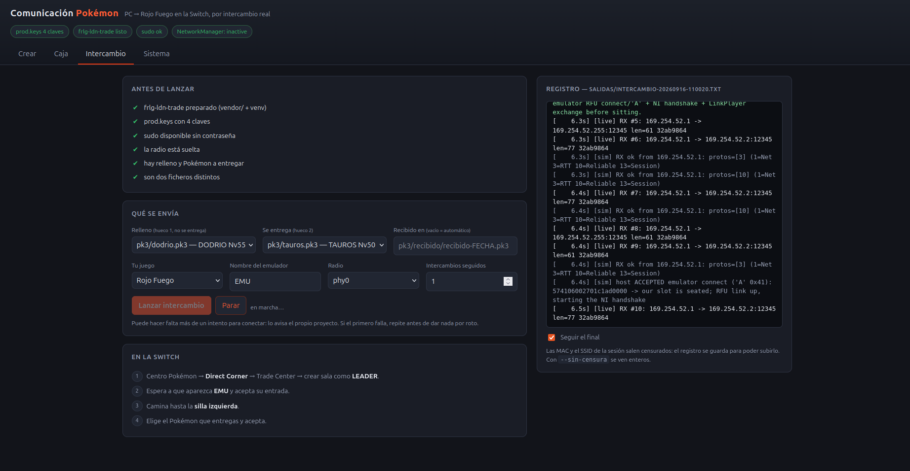
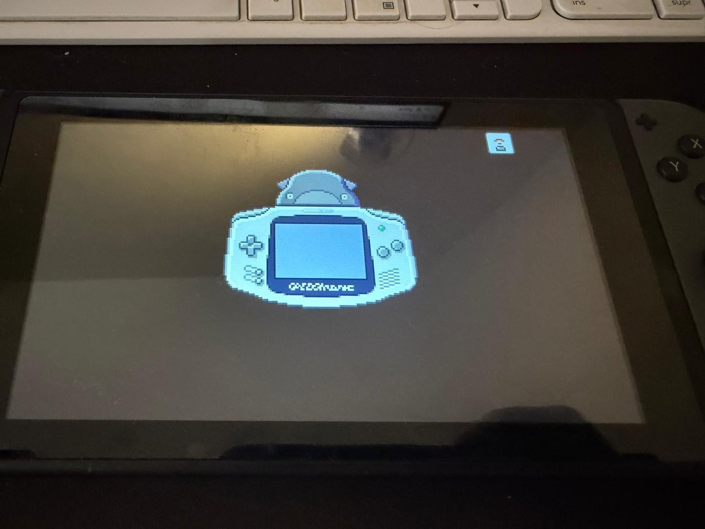
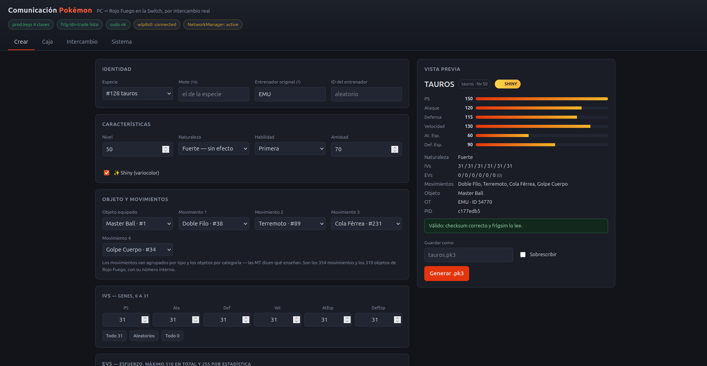
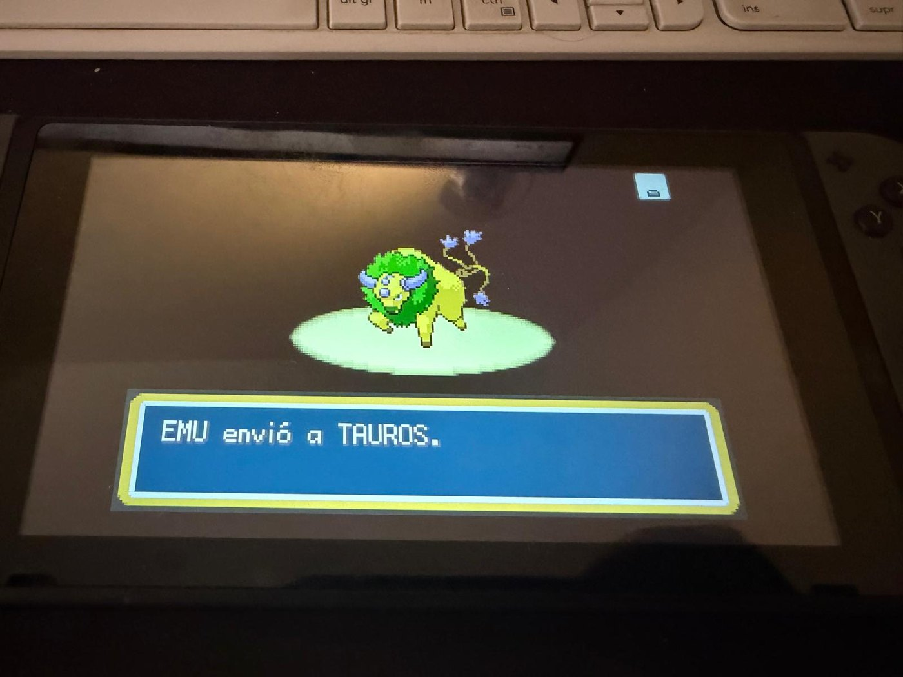

# La arquitectura, por dentro

Esto es la mitad técnica del proyecto. La mitad visual —cómo se hace un
intercambio, paso a paso y con capturas— está en el
[README](../README.md).

Aquí no hay instrucciones: hay **por qué**. Cómo viaja un Pokémon de 80 bytes
desde un fichero hasta una consola, por qué el formato está cifrado con un XOR
de juguete, por qué las claves daban menos miedo del que parecía, y cómo se
ordenó el trabajo cuando había dos incógnitas capaces de matar el proyecto
entero.

**Índice**

- [El recorrido de un byte](#el-recorrido-de-un-byte) — las seis capas
- [Anatomía de un `.pk3`](#anatomía-de-un-pk3) — 80 bytes y un PID que lo gobierna todo
- [Las claves](#las-claves-menos-misterio-del-que-parece) — qué pide LDN de verdad
- [Cómo se depura](#cómo-se-depura-síntoma--capa) — síntoma → capa
- [El método](#el-método-por-qué-el-orden-importó) — por qué el orden importó
- [Glosario](#glosario)

---

## El recorrido de un byte

Esta es la idea central del proyecto, y merece la pena entenderla antes de
tocar nada. Cuando eliges «Pikachu» en la ventana y le das a intercambiar, ese
Pikachu baja por seis capas hasta convertirse en ondas de radio, y sube por
otras seis dentro de la Switch.

```
   TÚ                          especie, nivel, movimientos, shiny…
    │
 1  │  .pk3                    80 bytes: el Pokémon como lo guarda el juego
    │
 2  │  bloques de intercambio  la party de 6 en trozos de 200 bytes
    │
 3  │  RFU                     ranuras de 14 bytes, una por fotograma del GBA
    │
 4  │  Pia                     mensajes fiables, comprimidos y cifrados (AES-GCM)
    │
 5  │  LDN                     la "red local" de Nintendo sobre UDP/IP
    │
 6  │  802.11                  frames Wi-Fi crudos, inyectados en modo monitor
    ▼
   AIRE  ~ ~ ~ ~ ~ ~ ~ ~ ~ ~ ~ ~ ~ ~ ~ ~ ~ ~ ~ ~ ~ ~ ~►  Nintendo Switch
```

Lo importante: **este repositorio sólo implementa la capa 1**. Las demás ya
estaban resueltas por terceros, y usarlas tal cual —sin tocarlas— fue una
decisión deliberada.

| Capa | Qué hace | Quién la implementa |
|---|---|---|
| 6 — 802.11 | Enviar y recibir *action frames* en modo monitor. La tarjeta tiene que poder **inyectar**, no sólo navegar | driver del kernel + [`kinnay/LDN`](https://github.com/kinnay/LDN) |
| 5 — LDN | El protocolo con el que dos Switch se ven sin router. Anuncia la sesión en un *beacon* cifrado; el que se une recibe una IP `169.254.x` | [`kinnay/LDN`](https://github.com/kinnay/LDN) |
| 4 — Pia | La librería de red de Nintendo por encima: paquetes con cabecera de 29 bytes, cifrado AES-GCM, compresión zstd y una capa *reliable* (reenvíos, orden) | [`frlgsim/crypto.py`](https://github.com/tornadus/frlg-ldn-trade/blob/main/frlgsim/crypto.py), [`reliable.py`](https://github.com/tornadus/frlg-ldn-trade/blob/main/frlgsim/reliable.py) |
| 3 — RFU | El **adaptador inalámbrico del Game Boy Advance**, emulado. El juego de Switch sigue creyendo que habla con un GBA: manda una ranura de 14 bytes por cada fotograma | [`frlgsim/rfu.py`](https://github.com/tornadus/frlg-ldn-trade/blob/main/frlgsim/rfu.py) |
| 2 — Intercambio | La máquina de estados del Trade Center: quién pide qué bloque, quién confirma, quién cancela | [`frlgsim/trade.py`](https://github.com/tornadus/frlg-ldn-trade/blob/main/frlgsim/trade.py) |
| 1 — El Pokémon | Construir el `.pk3`, validarlo, gestionarlo y lanzar el intercambio | **este repositorio** |

La capa 3 es la más bonita del asunto: la versión de Switch **no reimplementa
el multijugador**, emula el GBA entero, así que por dentro sigue circulando el
protocolo del accesorio inalámbrico de 2004. El PC no simula una Switch: simula
una Game Boy Advance con adaptador, envuelta en capas modernas de Nintendo.

> **Por qué la separación importa.** Si algo falla, el síntoma dice en qué capa
> mirar (ver [más abajo](#cómo-se-depura-síntoma--capa)). Meter el generador de
> Pokémon dentro del código de red habría convertido cada fallo en una búsqueda
> a ciegas por todo el sistema.

---

### La capa 3, fotografiada

Esto no es una metáfora ni una simplificación didáctica: es lo que las dos
máquinas dicen de sí mismas, en el mismo instante.

| El PC, en su registro | La Switch, en pantalla |
|---|---|
|  |  |
| `host ACCEPTED emulator connect ('A' 0x41)` `-> our slot is seated; RFU link up,` `starting the NI handshake` | El juego dibuja una **Game Boy Advance** como la consola del otro lado |

La animación del intercambio no enseña una Switch porque, para el código que la
ejecuta, al otro lado no hay una Switch: hay una Game Boy Advance con su
adaptador inalámbrico. El PC no tuvo que engañar a nadie sobre eso — se limitó a
hablar el protocolo que el juego esperaba oír.

---
## Anatomía de un `.pk3`

Un Pokémon de 3ª generación son **80 bytes** (100 si va en el equipo, con las
estadísticas calculadas al final). El formato es el mismo que usa PKHeX, así
que lo que genera este repositorio es intercambiable con el resto del
ecosistema.

```
 offset            0                              32                        80
                   ├──────── cabecera (32 B) ─────┼──── región segura (48 B) ─┤
                   │ PID · OT-ID · mote · idioma  │  4 subestructuras de 12 B │
                   │ nombre del entrenador        │  G · A · E · M            │
                   │ checksum                     │  cifradas y barajadas     │
```

Las cuatro subestructuras de 12 bytes:

| | Contenido |
|---|---|
| **G** — Growth | especie, objeto que lleva, experiencia, amistad |
| **A** — Attacks | los cuatro movimientos y sus PP |
| **E** — EVs | los 6 EVs y las estadísticas de concurso |
| **M** — Misc | pokerus, lugar de captura, **IVs**, cintas, bit *fateful* |

Y aquí está lo que hace que el formato sea entretenido: **el PID lo gobierna
casi todo**.

```
 PID  (4 bytes, "personality value")
  ├── PID % 25   →  la naturaleza
  ├── PID % 24   →  en qué ORDEN físico se guardan G, A, E, M (24 permutaciones)
  ├── PID ^ OT-ID →  la clave XOR que cifra los 48 bytes de la región segura
  └── (OTid_alto ^ OTid_bajo ^ PID_alto ^ PID_bajo) < 8   →  es shiny
```

Consecuencias prácticas, todas visibles en el código:

- **No puedes elegir naturaleza y shiny por separado.** Las dos salen del mismo
  número. `make_pk3.py` no sortea a lo bruto: fija la mitad baja del PID y
  despeja la alta para forzar el shiny, dejando sólo la naturaleza al azar
  (1 de cada 25 intentos). Ver `buscar_pid()` en
  [`scripts/make_pk3.py:152`](../scripts/make_pk3.py#L152).
- **El cifrado es un XOR**, no criptografía de verdad: sirve para que no puedas
  editar la RAM con un dispositivo tipo Action Replay, no para proteger nada.
- **El checksum es una suma plana** de los 24 enteros de 16 bits de la región
  segura descifrada. Al ser plana, no depende del barajado: vale igual antes y
  después de permutar los bloques.
- **El bit 31 de la palabra de cintas** (`modernFatefulEncounter`) decide si un
  Mew o un Deoxys **se puede intercambiar**. Sin él, el juego responde «el otro
  entrenador no ha podido enviar su Pokémon» y no explica más. Costó un
  intercambio fallido descubrirlo; `make_pk3.py` ya lo pone solo para las
  especies 151 y 410.

### Cómo se valida sin fiarse de uno mismo

El generador **no comprueba su propio trabajo**. Después de construir los 80
bytes, se los pasa a `frlgsim.mon.Mon` —el mismo parser que leerá el fichero
durante el intercambio real— y exige tres cosas: que el checksum cuadre, que la
especie y el nivel decodificados sean los pedidos, y que **cifrar y volver a
descifrar devuelva byte a byte lo mismo**. Si el árbitro es el código del otro
proyecto, un error de interpretación del formato salta en el PC y no en mitad
de un intercambio.

```bash
python3 scripts/make_pk3.py --especie gengar --nivel 40 --naturaleza firme --shiny \
    --movimientos "Rayo,Psíquico,Puño Hielo,Bola Sombra" --objeto "Huevo Suerte" \
    --ivs 31,31,31,31,31,31 -o pk3/gengar.pk3
python3 scripts/read_pk3.py pk3/gengar.pk3
```

Los nombres valen en español, en inglés o por número interno; de eso se encarga
[`scripts/tablas/`](../scripts/tablas/README.md).

---

### El PID, fotografiado

Marcas la casilla «shiny» en el navegador. El generador no guarda un bit
«es shiny» en ninguna parte: se pone a sortear PID hasta que uno cumple
`(OTid_alto ^ OTid_bajo ^ PID_alto ^ PID_bajo) < 8`. Lo que llega a la consola
es ese número, y el juego deduce el color al dibujarlo.

| Lo que pides | Lo que sale |
|---|---|
|  |  |
| `PID c177edb5` — el número que cumplió la condición | Melena verde en vez de marrón, en una consola real |

Compáralo con [`img/pc-01-crear-basico.png`](img/pc-01-crear-basico.png), el
mismo Tauros sin marcar la casilla: `PID c928c34a`. Cambia el número, cambia
todo lo demás.

---
## Las claves: menos misterio del que parece

LDN va cifrado, y el proyecto pide un `prod.keys`. Eso suena a que hace falta
volcar la memoria de tu consola, y durante un tiempo **se dio el proyecto por
bloqueado por ese motivo**. Era falso, y la corrección salió de leer el código
en lugar de suponer:

`ldn.load_keys()` sólo usa **tres valores**: `aes_kek_generation_source`,
`aes_key_generation_source` y un master key (`master_key_00` para LDN v1,
`master_key_12` para v3). Los tres son **constantes comunes a todas las
consolas de retail**: no identifican tu aparato, no salen de tu aparato y no
cambian entre unidades. El modelo de consola es irrelevante y un modchip no
aportaría nada.

Lección adicional: `master_key_12` era lo único que faltaba para el primer
intercambio. La sesión negociaba **LDN v3**, cuyo anuncio va en AES-GCM; con
sólo `master_key_00` la radio *recibía* las tramas pero no las entendía, y el
escaneo decía «he visto 0 redes» cuando en realidad estaba oyendo perfectamente
a la Switch. Un error de descifrado disfrazado de error de hardware.

Trazabilidad completa, con enlaces al código de origen, en
[`docs/03_prod_keys.md`](03_prod_keys.md). Validador incluido:

```bash
python3 scripts/check_keys.py
```

---

## Cómo se depura: síntoma → capa

Esta tabla es el motivo por el que las capas están separadas. Cada fallo tiene
una firma distinta y te dice dónde mirar sin buscar a ciegas.

| Síntoma | Capa | Qué hacer |
|---|---|---|
| `EMU` no aparece en la Switch | 6 — Wi-Fi | Repetir `check_injection.sh`. Y repetir el intento: enganchar puede costar varios |
| `no joinable FRLG network (saw 0)` | 6 o 5 | `escuchar_ldn.sh` cuenta *action frames* en crudo, sin claves: si ve alguno, la radio va bien y el problema está más arriba |
| `Failed to parse advertisement frame` | 5 — LDN | Oyes a la Switch pero no la entiendes: falta `master_key_12` |
| `KeyError` / `ValueError` al arrancar | claves | `python3 scripts/check_keys.py` |
| `EMU` aparece pero no entra | 4 — Pia | Guardar la salida completa con `--verbose` |
| Entra pero el intercambio falla | 2/3 — RFU y máquina de estados | Salida completa; comparar con un registro que sí funcionó |
| El Pokémon sale raro dentro del juego | 1 — el `.pk3` | `python3 scripts/read_pk3.py` sobre el fichero |
| Funciona a mano pero no desde la ventana | GUI | El runbook tiene el comando exacto que la GUI ejecuta |

El detalle de cada uno está en [`docs/04_runbook_ubuntu.md`](04_runbook_ubuntu.md),
sección «Si algo falla».

---

## El método: por qué el orden importó

La parte más reutilizable de este proyecto no es el código. Es cómo se ordenó
el trabajo cuando había dos incógnitas capaces de matarlo entero.

**1. Primero se atacan los riesgos, no lo divertido.** Los dos riesgos eran «la
tarjeta Wi-Fi puede no servir» y «sin las claves no hay nada». Ninguno se
resolvía escribiendo código bonito, así que lo primero que se construyó fueron
dos scripts de diagnóstico. La GUI —la parte apetecible— fue lo último.

**2. Nada de generador ni de interfaz hasta que un intercambio funcionó a
mano.** Si escribes el generador antes y el intercambio falla, tienes que
depurar a la vez tu código y un protocolo que no conoces. Con un `.pk3` prestado
funcionando primero, cuando el generador falla sabes que el fallo es tuyo.

**3. Leer el código antes de creerse una conclusión.** Dos veces se dio algo por
imposible y las dos veces era falso:
   - *«La consola es Mariko, no se pueden volcar las claves, proyecto muerto.»*
     Falso: el proyecto sólo usa tres constantes comunes a todas las consolas.
     Se vio siguiendo `load_keys()` hasta `_derive_key()`.
   - *«La tarjeta no está en la lista de compatibles, hay que comprar otra.»*
     Falso: `aireplay-ng --test` dijo `Injection is working!`. La lista del
     proyecto original era corta, no exhaustiva.

**4. Verificar los datos contra su fuente, no contra la memoria.** Al montar las
tablas de objetos y movimientos apareció que «Cabezazo» no es *Headbutt* sino
*Skull Bash*, y que PokeAPI cuelga dos objetos del mismo índice 261 mientras que
en FireRed ese índice es el Buscaobjetos. Las dos cosas habrían generado
Pokémon sutilmente mal. Los ids vienen de la decompilación `pokefirered`, que es
la fuente autoritativa; PokeAPI sólo aporta nombres. Ver
[`scripts/tablas/README.md`](../scripts/tablas/README.md).

**5. Escribir la bitácora mientras pasa.** [`docs/ESTADO.md`](ESTADO.md)
registra cada prueba con su fecha y su resultado, incluidos los fallos y las
correcciones al diseño original. El blueprint se dejó **intacto** como documento
histórico y las correcciones viven aparte: así se puede ver en qué se acertó al
planificar y en qué no.

**6. Errores que costaron caro y ahora están automatizados.** El segundo
intercambio machacó el Pokémon del primero porque la salida tenía nombre fijo;
ahora lleva fecha. Un registro subido con las MAC a la vista costó reescribir el
historial de git; ahora la GUI las censura sola.

---

## Glosario

| Término | Qué es |
|---|---|
| **LDN** | *Local Data Network*: el modo en que dos Switch se comunican sin router ni Internet |
| **Pia** | La librería de red de Nintendo que va por encima de LDN: fiabilidad, compresión, cifrado |
| **RFU** | El adaptador inalámbrico del Game Boy Advance. La versión de Switch lo emula, y por eso sigue vivo aquí |
| **`.pk3` / `.ek3`** | Un Pokémon de 3ª generación en 80 bytes: descifrado (`pk3`) o tal como viaja, cifrado y barajado (`ek3`) |
| **PID** | El número de 4 bytes del que salen la naturaleza, el shiny, el cifrado y el orden interno |
| **IV / EV** | Valores individuales (genética, 0-31) y de esfuerzo (entrenamiento, hasta 510 en total) |
| **Modo monitor / inyección** | Poder recibir *todos* los frames Wi-Fi, y poder transmitir frames arbitrarios. LDN necesita las dos cosas |
| **Direct Corner** | La zona del Centro Pokémon donde se hacen los intercambios locales en FireRed |
| **EMU** | El nombre con el que aparece el PC dentro del juego |

---

